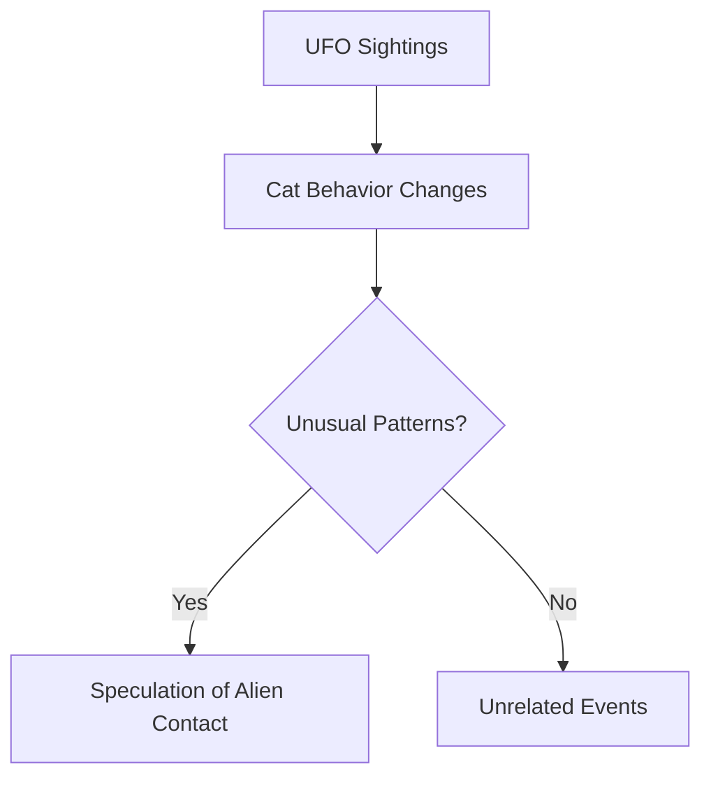

# The History of Cats and Aliens: A Cosmic Tale

## Introduction

For centuries, humanity has been fascinated by the enigmatic nature of cats and the possibility of
extraterrestrial life. While these two subjects might seem worlds apart, there is a surprising
connection that runs deeper than one might initially suspect. This document explores the
intriguing history of how cats and aliens have been interwoven in myth, science, and speculative
fiction.

## Ancient Myths and Legends

The first records of cats being associated with celestial beings date back to ancient Egypt. Cats,
especially those with unusual features like glowing eyes, were often considered emissaries of the
gods. The goddess Bastet, a feline deity, was revered as a protector of the home and a symbol of
divine mystery. Some texts even describe how Bastet was said to come from the "stars," hinting at a
cosmic origin.

### Key Myths:

- Bastet as a celestial protector
- Black cats and astronomical events in Europe
- Feline omens in early Asian astronomy

In the medieval period, European folklore included tales of black cats appearing during strange
astronomical events. These cats were sometimes linked to sorcery, but others believed they were
harbingers of visitors from beyond the skies. Such stories fed into an enduring association
between cats and the unknown.

## The Modern Era: UFOs and Cats

The modern UFO phenomenon, beginning in the 20th century, brought a new dimension to the
cat-alien narrative. Reports from abductees occasionally mentioned cats behaving oddly during
encounters with unidentified flying objects. Some speculated that cats might act as conduits for
alien communication or as biological recording devices.

### Incident in New Mexico:

- Sightings of strange lights in the sky
- A family cat exhibiting erratic behavior
- Speculation about extraterrestrial influence

In the 1970s, a peculiar incident in New Mexico involved a family reporting strange lights in the
sky. Their cat, whom they described as unusually intelligent, began exhibiting erratic behavior,
leading some to theorize that it had been "contacted" by extraterrestrial beings. While such
claims remain unverified, they have contributed to the mystique surrounding cats and their
possible connection to aliens.

### Cats and UFO Activity Graph

## Science Fiction: Cats in Space

Science fiction has further cemented the bond between cats and aliens. The iconic 1979 film *Alien*
features Jonesy, a cat aboard the spaceship Nostromo. Jonesy's calm demeanor amidst chaos sparked
debate about whether cats might possess an innate ability to sense or even communicate with
non-human life forms.

### Notable Examples in Fiction:

1. **Jonesy from *Alien***  
   A calm companion amidst extraterrestrial threats.
2. **Guardians in Diane Duane's *The Book of Night with Moon***  
   Cats as protectors of interdimensional gateways.
3. **Humorous portrayals in animated series**  
   Cats as quirky, spacefaring allies.

In literature, cats are often portrayed as allies or adversaries of extraterrestrials. For example,
in Diane Duane's *The Book of Night with Moon*, cats are guardians of interdimensional gateways,
tasked with maintaining balance between worlds. These fictional accounts amplify the perception of
cats as otherworldly creatures.

## Theoretical Perspectives

Some fringe theories suggest that cats themselves might be alien in origin. Proponents of this
idea argue that cats' unique physiology, particularly their reflective eyes and inexplicable
behavior, indicates a lineage not entirely of Earth. These theories lack scientific backing but
are nonetheless a fascinating lens through which to view our feline companions.

### Cat Behavior Highlights:

- Unpredictable responses to environmental changes
- Sensory abilities exceeding human perception
- Possible evolutionary advantages from unknown sources

On a more grounded note, studies have shown that cats possess highly developed sensory systems.
While this does not necessarily imply alien ancestry, it does underscore how remarkable these
creatures are. Their ability to detect subtle environmental changes might explain their perceived
connection to extraterrestrial phenomena.

## Conclusion

Cats and aliens occupy unique places in human imagination and culture. While definitive proof of
their connection remains elusive, the parallels between these enigmatic subjects continue to
inspire curiosity and creativity. Whether as symbols of the unknown or as literal companions to
star travelers, cats will undoubtedly remain a subject of fascination for generations to come.

---

*This report is a fictional exploration of the intersection between cats and aliens, designed to
provoke thought and entertain rather than provide scientific insight.*
